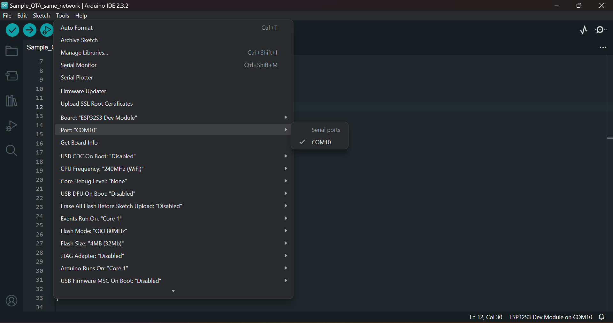
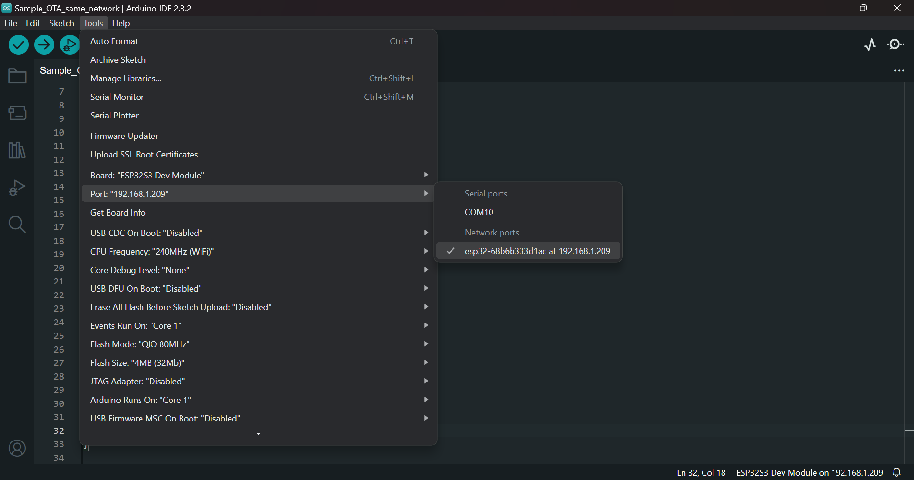

# ESP32 OTA (Over-The-Air) Update Guide

## Introduction to OTA Updates

Over-The-Air (OTA) updates are a way to remotely update the software running on an ESP32 without the need for physical access to the device. This is particularly useful for devices deployed in hard-to-reach places or where manual updating is impractical. The ESP32 supports OTA updates, allowing developers to deploy firmware changes seamlessly and wirelessly.

## Initial Upload using USB

Before you can use OTA updates, the ESP32 must be programmed with the initial OTA-enabled firmware via USB.

### Port Selection for Initial Upload

When you first upload your code to the ESP32, you will need to connect the device to your computer with a USB cable. Select the appropriate COM port from the Arduino IDE:

This image illustrates how to select the correct COM port for the initial firmware upload.

## OTA Updates after Initial Upload

After your ESP32 has been programmed with the initial OTA-enabled firmware, you no longer need to connect it via USB for subsequent updates.

### Selecting Network Port for OTA Updates

For future updates, you will select the network port that corresponds to your ESP32 device's IP address:

This image shows how to select the network port from the Arduino IDE. The ESP32 advertises its OTA service, which the Arduino IDE detects and displays as a network port.

## Steps for OTA Updates

1. Ensure that your ESP32 and computer are on the same network.
2. Make any necessary code changes in your Arduino sketch.
3. From the Arduino IDE, select the network port with your ESP32's IP address.
4. Click the upload button to wirelessly update your ESP32.

With OTA updates, you can easily push new features and bug fixes to your ESP32 device.

---

Feel free to contribute to this guide or suggest improvements!
